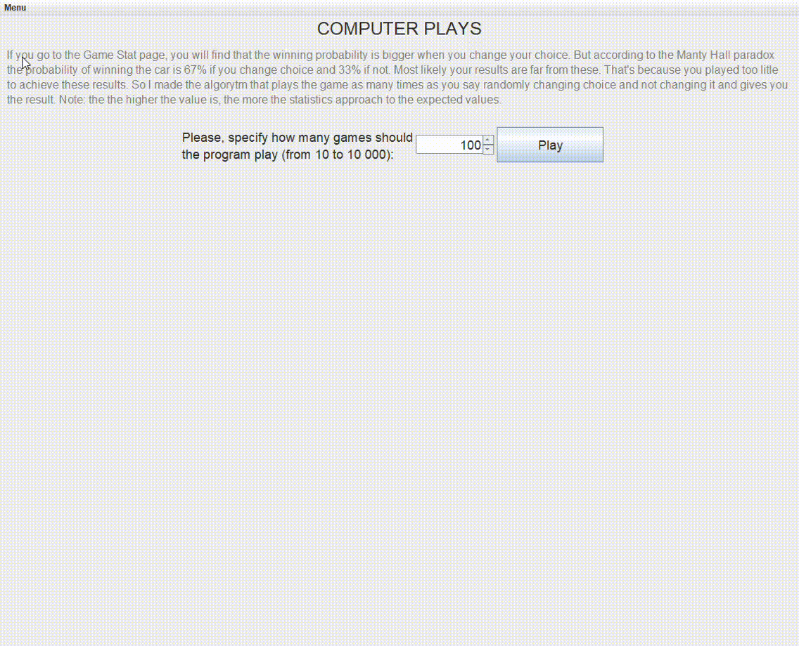
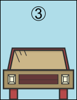

# Monty Hall project

I made this project to show you the idea of the Monty Hall problem so you can make sure that the right solution — always change the
door, is really true, which at first glance, conflicts with the common sense.

# How does the program work?

You choose the door, the program opens it but doesn't show you who is behind. Then it shows you where the goat is so you can deside to change
your choice or not. And you get the result with graphs and images. You can also see what was behind each door, jump to the history page or restart
the game.

The most interesting thing in the program is the Computer plays page. You specify the number of games to play, then program plays this number of games
same randomly changing choice and leaving it. Appeared graphs shows you that the winning probability if change choice really is 67%, if not — 33%.

# Skills used in the project

In the project besides usual java libraries are used:
- Swing, awt
- [JFreeChart](https://www.jfree.org/jfreechart/)
- [MigLayout](https://www.miglayout.com)

# If you don't know about Monty Hall problem

> Suppose you're on a game show, and you're given the choice of three doors: Behind one door is a car; behind the others, goats. You pick a door,
> say No. 1, and the host, who knows what's behind the doors, opens another door, say No. 3, which has a goat. He then says to you, "Do you want
> to pick door No. 2?" Is it to your advantage to switch your choice?

### It turns out that the winning probability is bigger if you switch your choice. I made this game so you will see that.
